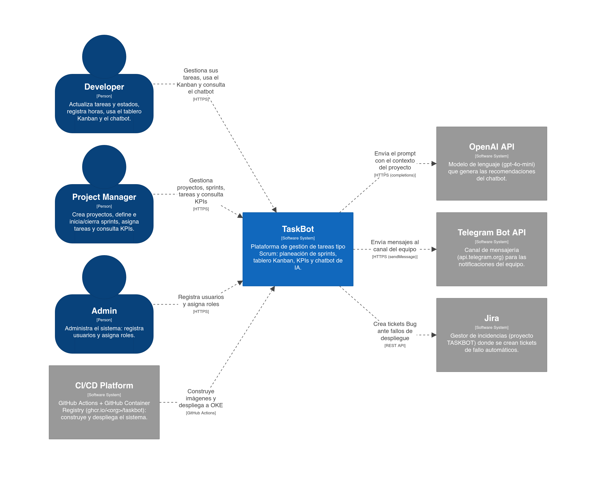
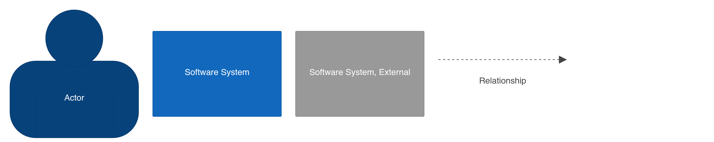
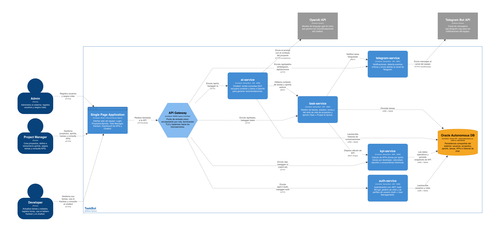
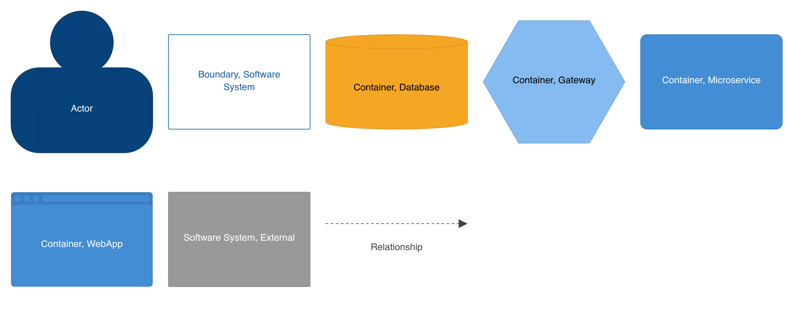
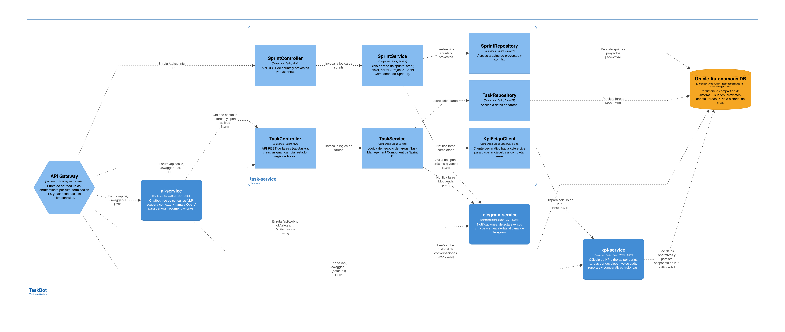
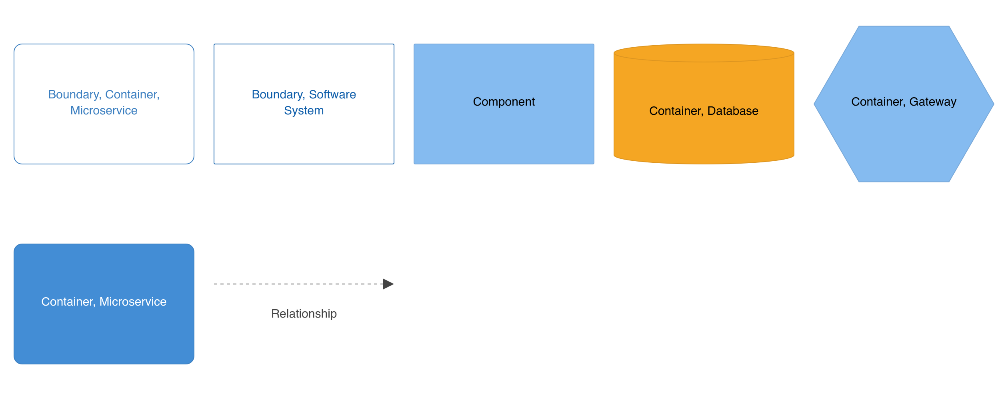
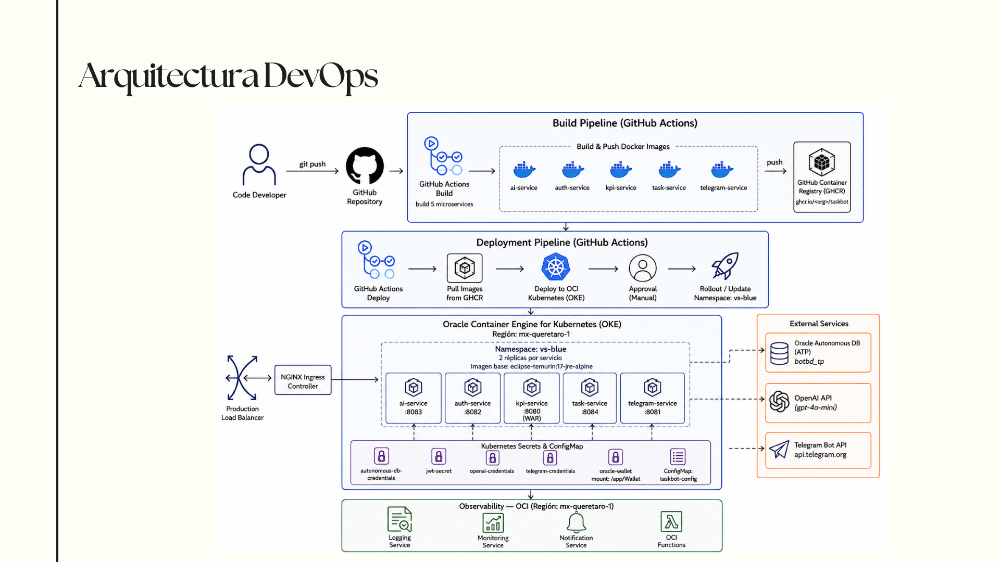
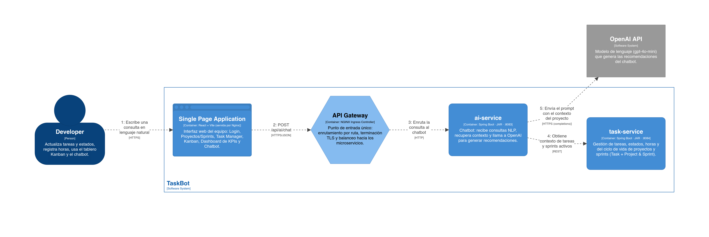
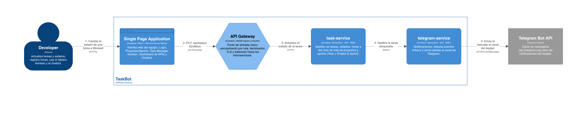
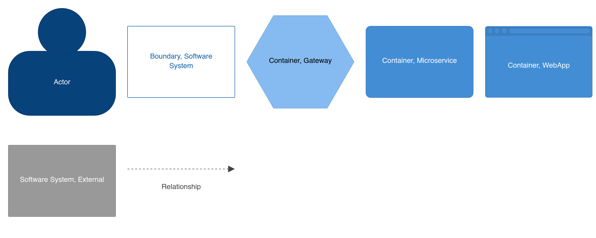

# TaskBot — Infraestructura y Arquitectura

Repositorio de infraestructura como código (Terraform) y documentación de arquitectura del sistema **TaskBot**: una plataforma de gestión de tareas tipo Scrum con tablero Kanban, KPIs y chatbot de IA.

El sistema se compone de cinco microservicios Java desplegados sobre **Oracle Container Engine for Kubernetes (OKE)** en la región `mx-queretaro-1`, con CI/CD orquestado por **GitHub Actions** e imágenes almacenadas en **GitHub Container Registry (GHCR)**.

---

## Tabla de contenidos

- [Diagramas de arquitectura (modelo C4)](#diagramas-de-arquitectura-modelo-c4)
  - [1. System Landscape](#1-system-landscape)
  - [2. System Context](#2-system-context)
  - [3. Container Diagram](#3-container-diagram)
  - [4. Component Diagram — task-service](#4-component-diagram--task-service)
- [Arquitectura de despliegue (DevOps)](#arquitectura-de-despliegue-devops)
- [Vistas dinámicas (casos de uso)](#vistas-dinámicas-casos-de-uso)
  - [UC01 — Consulta al chatbot](#uc01--consulta-al-chatbot)
  - [UC02 — Tarea bloqueada](#uc02--tarea-bloqueada)
- [Documentación adicional](#documentación-adicional)

---

## Diagramas de arquitectura (modelo C4)

La arquitectura del sistema se documenta siguiendo el **modelo C4** de Simon Brown. Cada nivel ofrece una vista con mayor grado de detalle: desde el panorama general del ecosistema (Landscape) hasta los componentes internos de un microservicio específico (Component).

Los diagramas fueron generados con [Structurizr](https://structurizr.com/) y exportados como PNG.

---

### 1. System Landscape

Vista del ecosistema completo en el que opera TaskBot: usuarios del sistema, sistemas externos con los que interactúa y plataforma de CI/CD que lo construye y despliega.

  

<b>Leyenda</b>

  

---

### 2. System Context

Vista enfocada en TaskBot como sistema central, mostrando los actores que lo utilizan (Developer, Project Manager, Admin) y los sistemas externos con los que se integra (OpenAI API, Telegram Bot API).

  

<b>Leyenda</b>

  

---

### 3. Container Diagram

Descomposición del sistema en sus contenedores ejecutables: la Single Page Application, el API Gateway (NGINX Ingress Controller), los cinco microservicios Spring Boot y la base de datos Oracle Autonomous.

  

<b>Leyenda</b>

  

---

### 4. Component Diagram — task-service

Vista interna del microservicio `task-service`, que muestra sus componentes principales: controladores REST (`TaskController`, `SprintController`), servicios de lógica de negocio (`TaskService`, `SprintService`), repositorios de acceso a datos (`TaskRepository`, `SprintRepository`) y el cliente Feign hacia `kpi-service`.

  

<b>Leyenda</b>

  

---

## Arquitectura de despliegue (DevOps)

Diagrama de alto nivel del pipeline de CI/CD y la infraestructura de despliegue: desde el `git push` del desarrollador hasta la actualización de los pods en el cluster OKE, incluyendo la integración con servicios externos (Autonomous DB, OpenAI, Telegram) y la observabilidad nativa de OCI.

  

---

## Vistas dinámicas (casos de uso)

Las vistas dinámicas muestran el flujo de interacción entre contenedores para casos de uso específicos del sistema.

### UC01 — Consulta al chatbot

Flujo en el que un Developer realiza una consulta en lenguaje natural al chatbot de IA. La petición atraviesa el SPA, el API Gateway y el `ai-service`, que recupera contexto desde `task-service` antes de enviar el prompt a OpenAI.

  

<b>Leyenda</b>

  

---

### UC02 — Tarea bloqueada

Flujo en el que un Developer cambia el estado de una tarea a `Blocked`. El `task-service` detecta el cambio y notifica al `telegram-service`, que envía una alerta al canal del equipo en Telegram.

  

<b>Leyenda</b>

  

---

## Documentación adicional

| Documento | Descripción |
|---|---|
| [`Plan_de_Accion_DevOps_TaskBot.md`](./Plan_de_Accion_DevOps_TaskBot.md) | Documentación detallada de la arquitectura DevOps: infraestructura OCI, configuración de Kubernetes, pipeline CI/CD, estrategia Blue/Green, observabilidad y migración a producción |
| [`architecture/`](./architecture) | Definición de la arquitectura en Structurizr DSL |
---

*TaskBot · Sprint 3 · Infraestructura sobre Oracle Cloud Infrastructure*
