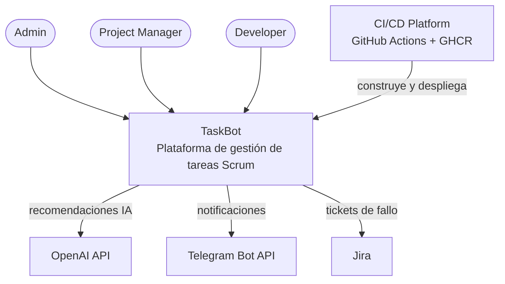
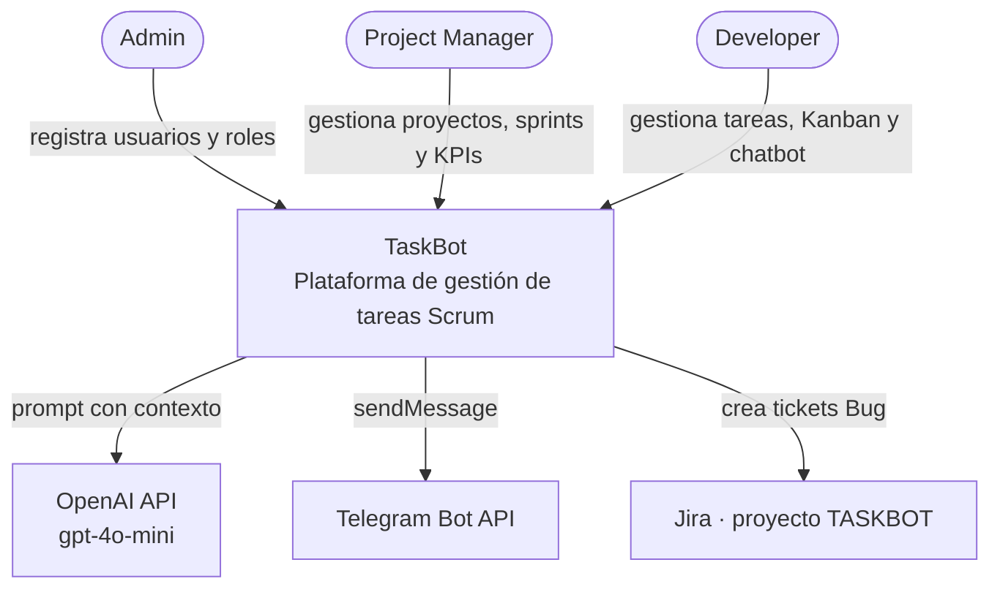
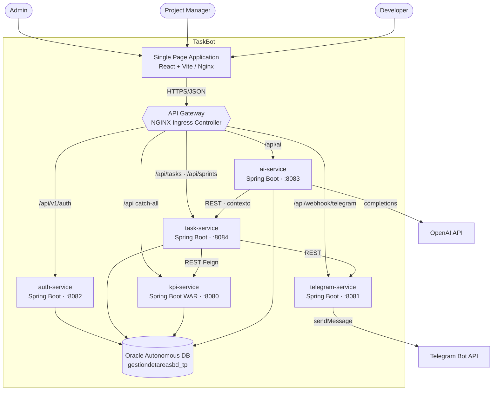
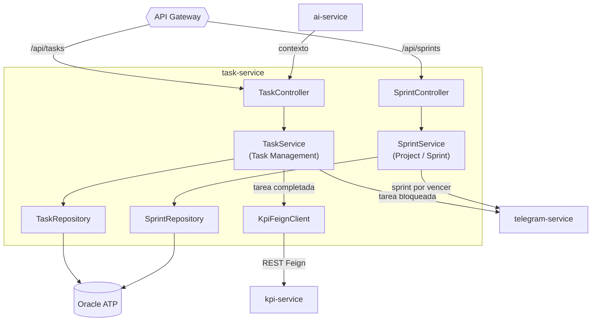
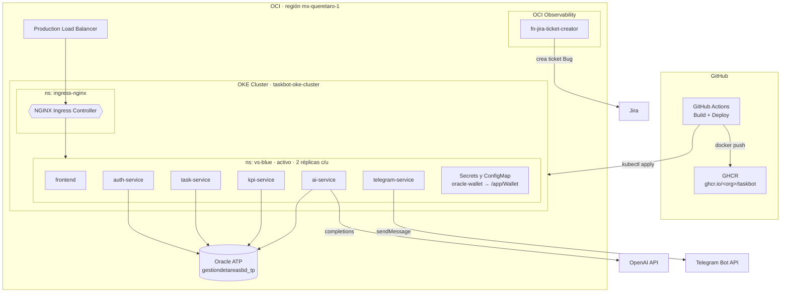
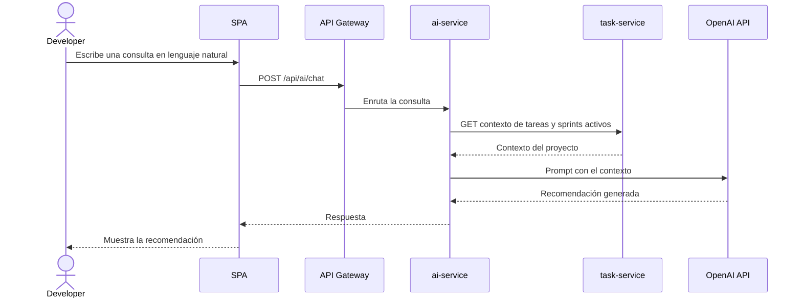
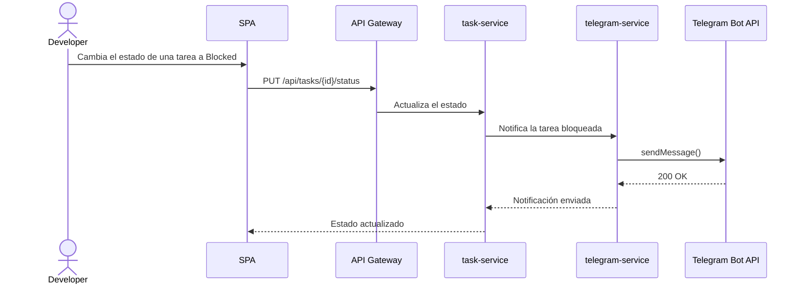

# Diagramas C4 — TaskBot (vista rápida en GitHub)

> Estos diagramas en **Mermaid** se renderizan automáticamente al abrir este archivo en GitHub.
> Son una capa de visualización cómoda; el artefacto de arquitectura formal es el modelo
> **Structurizr** (`model.dsl` + `model.json`), que se renderiza con Structurizr Lite (ver `README.md`).

---

## 1. System Landscape

Panorama de TaskBot en su ecosistema: actores, el sistema y los servicios externos (incluida la plataforma de CI/CD).

---

## 2. System Context

TaskBot como caja negra: quién lo usa y con qué sistemas externos interactúa en tiempo de ejecución.

---

## 3. Containers

Contenedores internos de TaskBot: SPA, API Gateway, los 5 microservicios y la base de datos.

---

## 4. Components — `task-service`

El `task-service` aloja dos bounded contexts de Sprint 1: **Task Management** y **Project & Sprint**.

---

## 5. Deployment — OCI / OKE (namespace activo `vs-blue`)

---

## 6. Dynamic — Caso de uso: recomendación del chatbot de IA

---

## 7. Dynamic — Caso de uso: tarea bloqueada → notificación a Telegram

